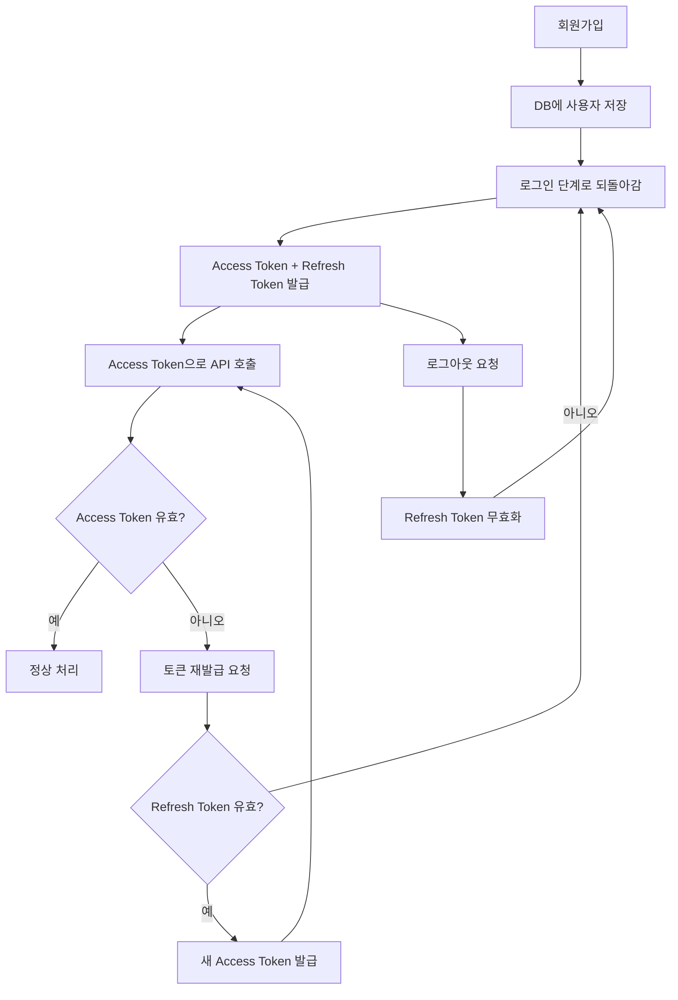

# 4Bit_Diary-
4Bit팀의 Diary만드는 Project

## 인증 흐름 요약

- **회원가입 (`/signup`)** → 사용자 정보를 DB에 저장하고 가입 완료 응답  
- **로그인 (`/login`)** → 이메일/비밀번호 검증 → 성공 시 Access + Refresh 토큰 발급, 실패 시 401 반환  
- **인증 요청** → Access Token 검증 → 유효 시 정상 응답, 만료 시 Refresh Token 확인 → 유효하면 새 Access Token 발급, 실패 시 401 반환  
- **로그아웃 (`/logout`)** → Refresh Token 블랙리스트 처리 후 로그아웃 완료
